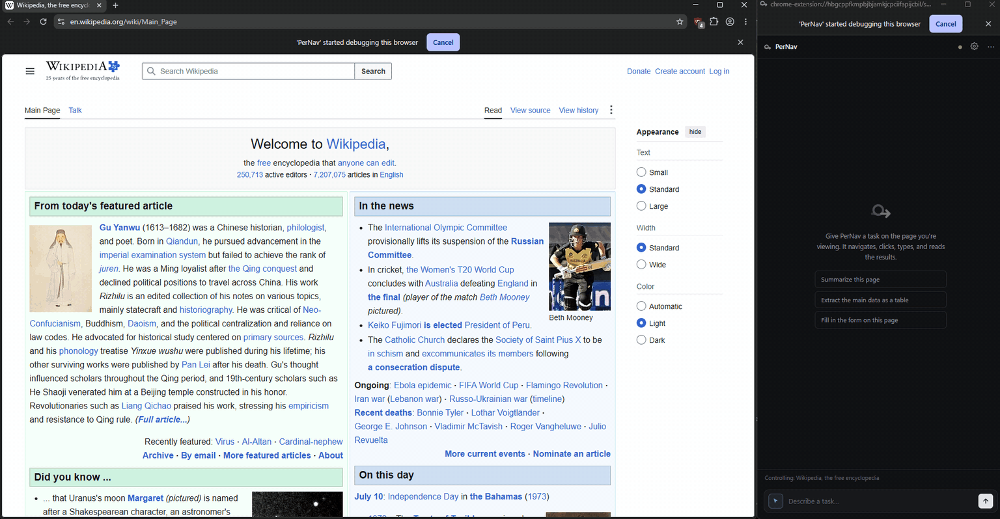
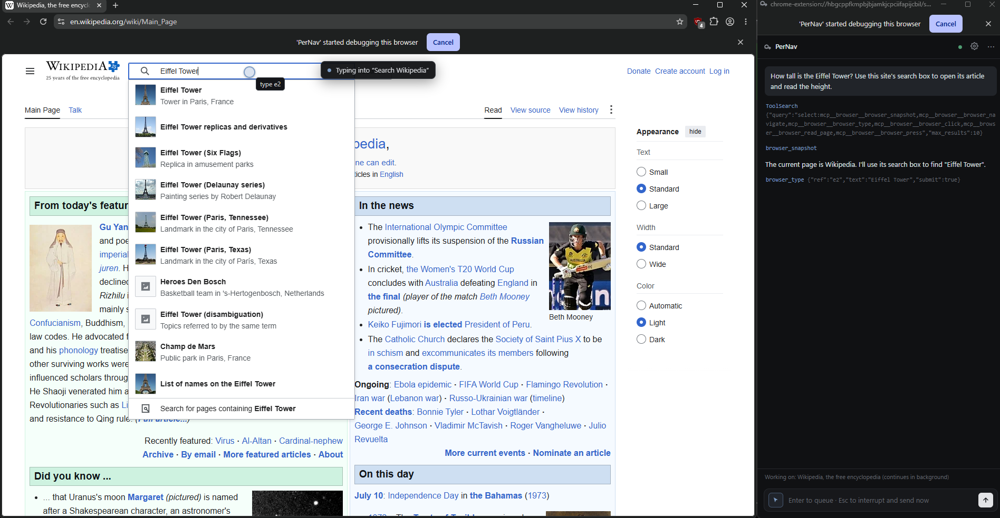
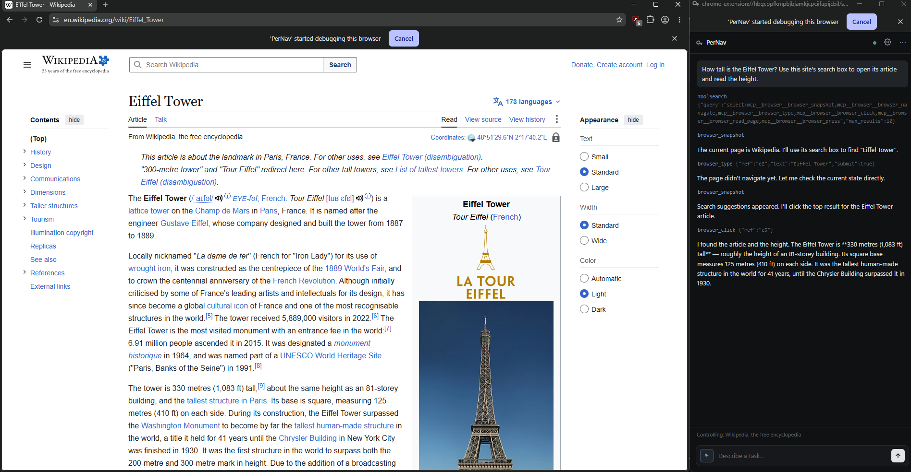

# PerNav

An open-source, Comet-style **AI sidebar that controls your browser** — powered by
**your own AI account**: a Claude subscription/API key, **your existing AI CLIs and
their subscriptions** — Codex CLI (ChatGPT Plus/Pro), Gemini CLI (free Google login),
Qwen Code, GitHub Copilot CLI — **or any other provider** with an API key: OpenAI
(ChatGPT models), Google Gemini, xAI Grok, DeepSeek, Qwen, Kimi (Moonshot), GLM (Z.ai),
MiniMax, Mistral, Groq, OpenRouter, a local Ollama, or any custom OpenAI-compatible
endpoint. You type a task in the sidebar; the agent takes over the tab you're looking
at, and you watch a cursor glide to each element and click.

Works in **any Chromium-based browser**: Chrome, Edge, Brave, Arc, Opera, Vivaldi,
and friends.



*A real run (sped up ~4×): "How tall is the Eiffel Tower?" — PerNav types into
the site's search box, picks the right suggestion, opens the article, and reads
out the height, narrating every tool call in the sidebar.*

```
┌──────────────┐    WebSocket     ┌───────────────────────────────────┐
│  Extension   │ ◀──────────────▶ │  Bridge (Node, runs locally)      │
│  side panel  │  ws://127.0.0.1  │  = the BRAIN, on YOUR account:    │
│  = the HANDS │  :8765           │  Claude Agent SDK (Anthropic),    │
│  chrome.     │                  │  your agent CLIs (Codex/Gemini/   │
│  debugger    │                  │  Qwen/Copilot via MCP shim), or   │
└──────────────┘                  │  any OpenAI-compatible provider   │
                                  └───────────────────────────────────┘
```

- **Brain:** your pick in Settings. **Anthropic** runs on the Claude Agent SDK (Claude
  Code engine) with your Pro/Max subscription or API key — default model **Claude
  Sonnet 5**, the sweet spot for agentic browser loops. **CLI providers** (Codex CLI,
  Gemini CLI, Qwen Code, Copilot CLI) run the CLI you already have installed and
  logged in — same idea as the Claude subscription: your existing plan, no API key.
  The bridge hands the CLI the browser tools through a local MCP shim. **Every other
  provider** (OpenAI, Gemini, Grok, DeepSeek, Qwen, Kimi, GLM, MiniMax, Mistral, Groq,
  OpenRouter, Ollama, custom) runs on the bridge's built-in agent loop over the
  provider's OpenAI-compatible API, with the same browser tools.
- **Hands:** an MV3 extension. The side panel drives the agent's tab via `chrome.debugger`
  (CDP) — DOM snapshots, real clicks/typing — and draws a cursor + highlight so you can
  watch it work.

Everything runs **on your machine**. There is no hosted service, no telemetry, no
account with us — your credentials go straight from the bridge to the provider you chose.

## Quick start

**1. Install + start the bridge** (needs [Node.js](https://nodejs.org) 18+):

```sh
cd bridge
npm install
npm start
# → [pernav] bridge listening on ws://127.0.0.1:8765
```

**2. Load the extension:**

- Open your browser → `chrome://extensions`
- Enable **Developer mode** (top right)
- **Load unpacked** → select the `extension/` folder
- Pin **PerNav** from the puzzle-piece menu, then click it to open the sidebar.
  (On a browser without the Side Panel API, it opens as a floating window instead —
  same functionality.)

> **Or do both in one command** — `.\launch.ps1` (Windows) or `./launch.sh`
> (macOS/Linux) starts the bridge and opens the first Chromium-based browser it
> finds (Chrome, Edge, Brave, Vivaldi, Opera, Chromium) with the extension
> already loaded, in an isolated profile that never touches your daily one. Pick a
> specific browser with `.\launch.ps1 -Browser brave` / `./launch.sh brave`, or pass
> a full path to any Chromium-based binary.

**3. Connect an account** — open the **Settings tab** (gear icon in the sidebar), pick
an **AI provider**, and connect it:

**Anthropic (Claude)** — three ways to authenticate:

| Method | Billing | How |
|---|---|---|
| **Claude Code login** (recommended) | Your Claude Pro/Max subscription | Run `claude` in a terminal, then `/login`. The bridge picks it up automatically — Settings will show "Connected". |
| **Subscription token** | Your Claude Pro/Max subscription | Run `claude setup-token` in a terminal, paste the token into Settings. Good when you don't want the full CLI login on this machine. |
| **API key** | Pay-as-you-go (no subscription needed) | Create a key at [console.anthropic.com](https://console.anthropic.com), paste it into Settings. |

**Your AI CLIs** — if you already use an agent CLI, PerNav can run on its login
(and its subscription/free tier) with zero extra setup — pick it in the provider
dropdown and Save. Settings shows live whether the CLI is installed and logged in:

| Provider | Runs on | Install | Log in |
|---|---|---|---|
| **Codex CLI** | Your ChatGPT Plus/Pro plan | `npm i -g @openai/codex` | `codex login` |
| **Gemini CLI** | Free Google-account tier | `npm i -g @google/gemini-cli` | `gemini` → Login with Google |
| **Qwen Code** | Free qwen.ai tier | `npm i -g @qwen-code/qwen-code` | `qwen` → Qwen OAuth |
| **Copilot CLI** | Your GitHub Copilot plan | `npm i -g @github/copilot` | `copilot` → `/login` |

The CLI runs headless per task; browser tools reach it through a local MCP shim, and
on Codex the conversation resumes natively across turns (`codex exec resume`). Model
defaults to whatever the CLI is configured with — override it in the Model dropdown
(for Codex, **refresh list** shows the models your ChatGPT login can use).

**Any other provider** — paste that provider's API key (Settings shows where to get
one): OpenAI, Google Gemini, xAI Grok, DeepSeek, Qwen (Alibaba), Kimi (Moonshot),
GLM (Z.ai/Zhipu), MiniMax, Mistral, Groq, or OpenRouter (one key, hundreds of models).
**Ollama** needs no key at all — point it at your local install and pick an installed
model. **Custom** takes any OpenAI-compatible base URL (LM Studio, vLLM, LiteLLM,
llama.cpp server, proxies). Regional endpoints (e.g. mainland-China URLs for Qwen,
Kimi, GLM) can be set in the Endpoint field.

**Every model, not a shortlist** — the model dropdown starts with a curated shortlist
and the **“refresh list”** button pulls the provider's full live model list from its
`/models` endpoint, so anything your key can access is selectable (or type any model
id via *Custom model id*).

Tokens/keys are stored **only** in a local config file (`~/.pernav/config.json`)
on your machine; the extension only ever sees masked previews.

## Use it

1. Go to the page you want to work on.
2. Open the sidebar. It should show a green dot (bridge online).
3. Type a task, e.g. *"search this site for pricing and open the first result"* and hit
   Enter (a "PerNav is debugging this browser" banner is normal).
4. The agent locks onto the tab you were on and works it — you can freely switch to other
   tabs or apps; it keeps running in the background. Follow-up messages continue the same
   conversation. **Esc** interrupts the current action (and, with text in the box, sends
   your message immediately).

## Screenshots

**The agent at work** — cursor overlay and action tooltip on the page, live
tool-call trace in the sidebar:



**The result** — the article it opened on the left, the answer it read on the right:



## Fast + background operation

- **Every action returns the updated page state** — the agent doesn't re-snapshot after
  each click/type, cutting model round trips roughly in half.
- **Event-driven waits** — navigation and clicks wait for the actual page load instead of
  fixed sleeps; the cursor animation only plays when you're watching the tab.
- **`browser_read_page`** — the agent reads a page's full text in one fast call instead of
  screenshotting; screenshots (compact JPEG) are a last resort.
- **Works in the background** — once a task starts, the agent locks onto its work tab and
  keeps going even if you switch tabs, windows, or apps. Focus emulation makes pages
  behave as if the tab were visible.
- **Multi-tab** — the agent can open, list, and switch tabs (e.g. read a login code from
  your email tab, then hop back).

## Settings

The gear icon in the sidebar opens Settings:

- **AI provider** — two groups: *Subscriptions & account logins* (Anthropic/Claude,
  Codex CLI, Gemini CLI, Qwen Code, Copilot CLI) and *API-key providers* (OpenAI,
  Google Gemini, xAI Grok, DeepSeek, Qwen, Kimi, GLM, MiniMax, Mistral, Groq,
  OpenRouter, Ollama local, custom endpoint). Each provider remembers its own
  key/endpoint/model.
- **Account** — auth method (Anthropic), CLI install + login status with setup
  commands (CLI providers, plus an optional path override), or API key + endpoint
  (everyone else), with live connection status.
- **Model** — curated shortlist per provider; **refresh list** fetches the provider's
  complete live model list, and *Custom model id* accepts anything.
- **Bridge address** — only change if you run the bridge on a custom port
  (`PERNAV_PORT=9000 npm start`).
- **Clear all chats** — chat history lives only in your browser's extension storage.

## Safety & privacy

- The agent is told to **stop and ask** before irreversible/high-stakes actions (delete,
  send, pay, change account security). It treats page content as untrusted data.
- The agent gets **browser tools only** — no filesystem or shell access. (If you @-attach
  a folder to a message, it additionally gets read-only access to that folder.) CLI
  providers are coding agents with their own shell tools, so the bridge reins them in:
  Codex runs in its **read-only sandbox**, Gemini/Qwen run with **built-in tools
  disabled**, and all of them work from a throwaway workspace folder with instructions
  to use only the browser tools.
- The bridge listens on **127.0.0.1 only** and **rejects WebSocket connections from web
  pages** (only browser-extension origins are accepted), so a malicious site can't drive
  your browser or spend your credits through it.
- `chrome.debugger` is powerful. The "…is debugging this browser" banner is the visible
  indicator that automation is active.
- Nothing is sent anywhere except the API of the provider **you** configured, using
  your own credentials.

## Troubleshooting

| Symptom | Fix |
|---|---|
| `bridge: offline` (red dot) | Start the bridge (`cd bridge && npm start`); it must say "listening". |
| Auth error when you send a task | Open Settings → Account. For Anthropic: log in (`claude` → `/login`), paste a `claude setup-token` token, or use an API key. For CLI providers: install the CLI and log in (commands shown in Settings). For other providers: check the API key and endpoint. |
| CLI provider says the CLI isn't installed but it is | The bridge looks on PATH; if the CLI lives elsewhere, put its full path in the Account section's path field (Settings) and Save. |
| Model list only shows a few entries | Save the provider's API key first, then hit **refresh list** — the full list comes live from the provider. Any model id also works via *Custom model id*. |
| A provider errors on tool use / images | Not every model supports function calling or vision. Pick a current flagship model (the shortlist entries all do tools; screenshots need a vision model). |
| "Attach failed" | The tab may have DevTools open, or it's a `chrome://` / Web Store page (can't be debugged). Use a normal page. |
| It bills my API key instead of my subscription | In Settings, pick a subscription method. The bridge ignores an inherited `ANTHROPIC_API_KEY` env var unless you explicitly choose "API key". |
| Changed provider/model/account but a task is mid-run | Changes apply from the next task; interrupt with Esc to switch sooner. |

## Files

- `bridge/bridge.mjs` — provider registry, Claude Agent SDK session (Anthropic),
  CLI engine (Codex/Gemini/Qwen/Copilot: headless spawn + session resume/transcript),
  OpenAI-compatible agent loop (everyone else), live model listing, WebSocket server,
  settings/config handling.
- `bridge/tools.mjs` — the browser tool definitions shared by every engine.
- `bridge/mcp-shim.mjs` — stdio MCP server the CLIs launch; forwards each tool call
  back to the bridge (and on to the extension) over the local WebSocket.
- `extension/sidepanel.js` — UI, Settings tab, `chrome.debugger` executor,
  snapshot/click/type, cursor overlay.
- `extension/background.js` — opens the sidebar (side panel, or a floating window
  on browsers without the Side Panel API).
- `extension/manifest.json` — MV3 permissions (`debugger`, `sidePanel`, …).
- `launch.ps1` / `launch.sh` — optional one-command launch: start the bridge +
  open any installed Chromium-based browser with the extension loaded in an
  isolated profile.

## Contributing

PRs welcome — there's no build step, it's all vanilla JS, and most changes fit
in a single file. [CONTRIBUTING.md](CONTRIBUTING.md) has the dev loop and a
guide to adding a provider (usually one registry entry). Bugs and ideas →
[issues](https://github.com/saintenvyss/PerNav/issues).

## License

[MIT](LICENSE)
